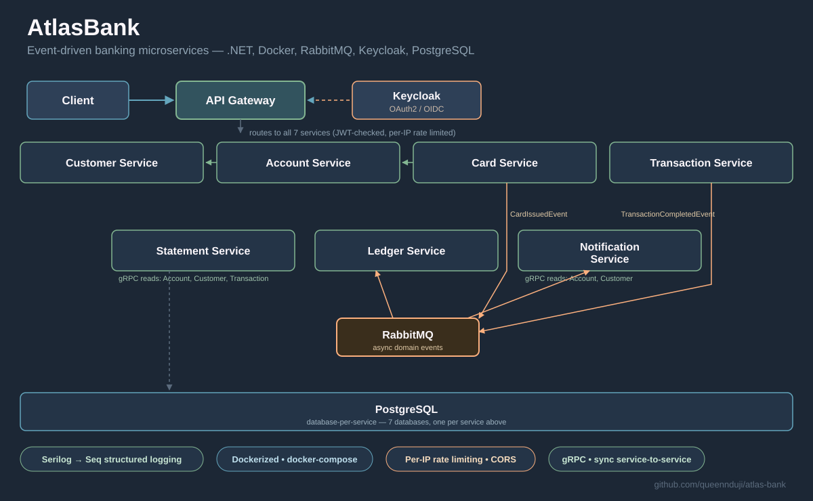

# AtlasBank

A banking system modeled as event-driven microservices in .NET — built to practice the kind of
distributed-systems patterns real banking platforms use: an API gateway, service-to-service gRPC,
async domain events over RabbitMQ, database-per-service, and centralized structured logging.



## Services

| Service | Responsibility | Talks to |
|---|---|---|
| **API Gateway** | Routes client requests, validates JWTs, rate-limits per IP | YARP reverse proxy → all services |
| **Customer Service** | Customer records | gRPC (queried by Account Service) |
| **Account Service** | Account balances, credit/debit | gRPC to Customer Service |
| **Transaction Service** | Processes transactions | Publishes `TransactionCompletedEvent` to RabbitMQ |
| **Ledger Service** | Records ledger entries | Consumes transaction events |
| **Notification Service** | Customer notifications | Consumes transaction/card events |
| **Card Service** | Card issuance | Publishes `CardIssuedEvent` |
| **Statement Service** | Account statements | gRPC to Account Service |

## Tech stack

- **.NET 10** / ASP.NET Core, **EF Core** + PostgreSQL (one database per service)
- **YARP** reverse proxy for the API Gateway, with JWT auth via **Keycloak** (OAuth2/OIDC) and per-IP rate limiting
- **gRPC** for synchronous service-to-service calls, **RabbitMQ** for async domain events
- **Serilog → Seq** for centralized structured logging
- **Docker Compose** for local orchestration
- **xUnit**, **FluentAssertions**, and **Testcontainers** (real PostgreSQL containers) for integration tests

## Frontend

A React + TypeScript client lives in [`frontend/`](frontend) — sign up, open accounts,
move money, issue cards, and pull statements against the gateway. See
[`frontend/README.md`](frontend/README.md) for setup.

## Getting started

```bash
git clone https://github.com/queennduji/atlas-bank.git
cd atlas-bank
docker-compose up --build
```

This brings up everything — Keycloak, PostgreSQL, RabbitMQ, Seq, all seven services, the
API Gateway, and the frontend. The frontend is at `http://localhost:3000`, the gateway at
`http://localhost:5000`, Seq's UI at `http://localhost:8081`.

> PostgreSQL replaced SQL Server so the whole stack can run on ARM (e.g. Oracle Cloud's
> free-tier VMs) — SQL Server's Docker image is amd64-only.

For active frontend development, run it outside Docker instead so you get hot reload —
see [`frontend/README.md`](frontend/README.md).

## Testing

```bash
dotnet test
```

Integration tests spin up real PostgreSQL containers via Testcontainers rather than mocking the database.

## License

MIT — see [LICENSE](LICENSE).
