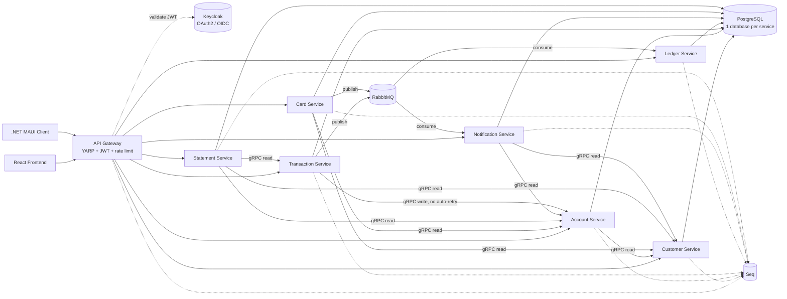
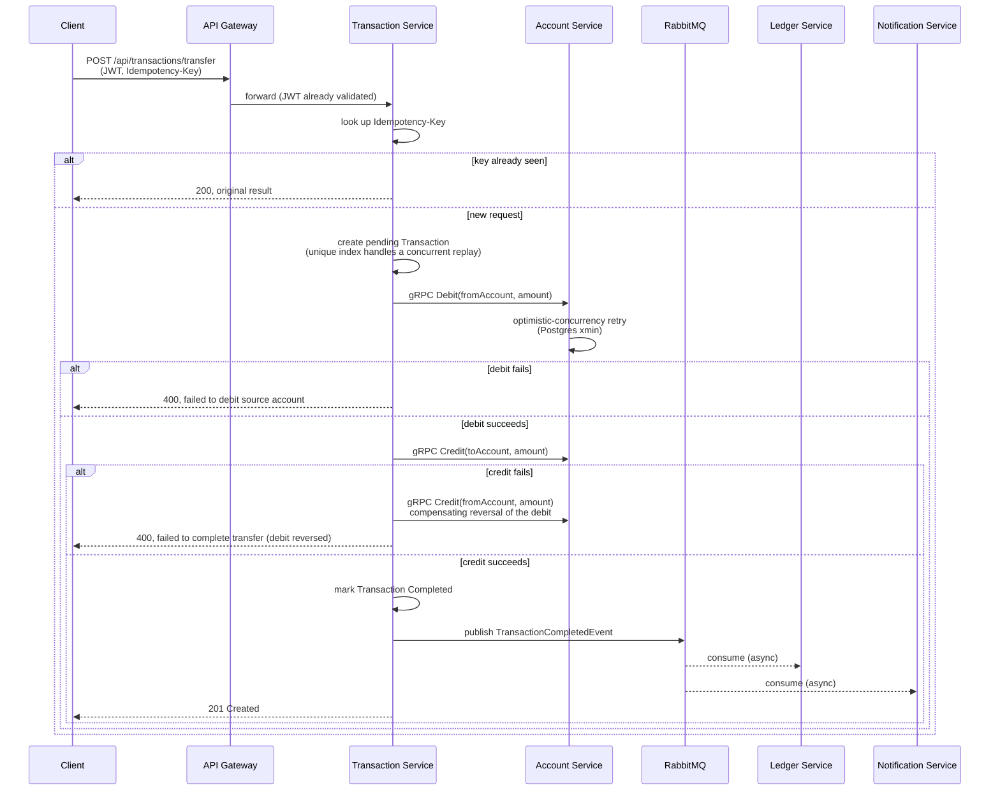

# Architecture

## Container view



Every service owns its own PostgreSQL database — there is no shared schema. Sync
service-to-service calls are gRPC; everything downstream of a completed transaction
(ledger postings, notifications) happens async over RabbitMQ instead of the caller
waiting on it directly.

## Request flow: `POST /api/transactions/transfer`

Transfer is the richest flow in the system — it's the one path with two dependent
writes to the same downstream service, which is what makes idempotency and the
compensating-reversal case worth showing in full rather than summarizing.



The `Credit`/`Debit` gRPC client on Transaction Service deliberately has no
automatic retry (see `AtlasBank.Shared.Resilience.GrpcResilienceExtensions`) — a
lost response after the write already landed would otherwise get silently
re-applied. Every other service's gRPC clients only ever call read-only RPCs, so
they get the full retry/circuit-breaker pipeline.

## Bounded contexts

| Service | Owns | Notes |
|---|---|---|
| **Customer Service** | Customer identity & profile | Provisions the Keycloak user itself as part of registration — there's no separate Keycloak self-service signup |
| **Account Service** | Account balances | Optimistic concurrency on every Credit/Debit (Postgres `xmin`, no distributed lock) |
| **Transaction Service** | Transaction records, idempotency keys | The only service whose gRPC client carries a non-idempotent write |
| **Ledger Service** | Double-entry ledger postings | Dedupes on `TransactionId` — RabbitMQ delivery is at-least-once |
| **Notification Service** | Customer notifications | Both a gRPC caller (reads Account/Customer) and an event consumer |
| **Card Service** | Card issuance, freeze state, spending limits | |
| **Statement Service** | Generated account statements | The only service with three outbound gRPC dependencies (Account, Customer, Transaction) |

## Running it

```bash
docker-compose up --build
```

See the [root README](../README.md#getting-started) for ports and prerequisites, and
each client's own README ([frontend](../frontend/README.md),
[AtlasBank.Maui](../src/Clients/AtlasBank.Maui/README.md)) for client-specific setup.

## Roadmap

**AtlasBank.Wpf** — a WPF client reusing `AtlasBank.Clients.Core` as-is (same API
client, same `OidcAuthenticator`, same `LoopbackOAuthBrowserLauncher`), supplying
only a WPF-flavored `ITokenStore` and its own Views/ViewModels. Not started yet.

For how the rest of the system got to its current state — the nginx/Caddy swap, the
Polly resilience rollout, optimistic concurrency and idempotency keys, the CSP
rollout — see the commit history rather than a maintained log here; a static roadmap
section tends to drift the moment nobody's actively updating it.
